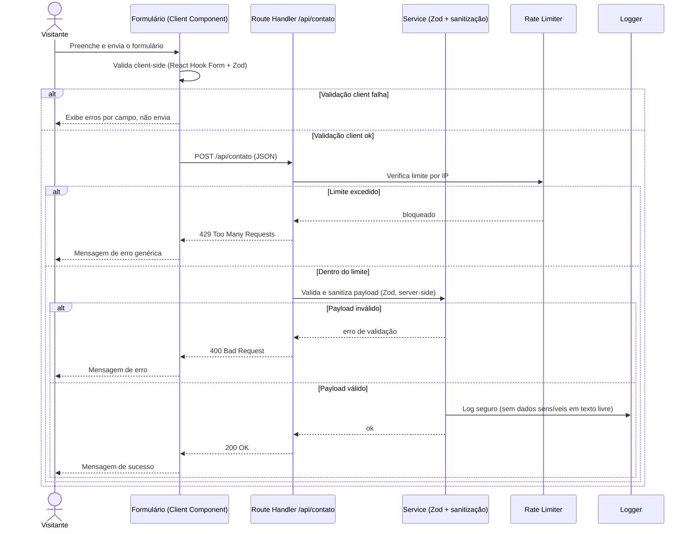

# Sequência — Envio do formulário de contato

```mermaid
sequenceDiagram
    actor V as Visitante
    participant F as Formulário (Client Component)
    participant R as Route Handler /api/contato
    participant S as Service (Zod + sanitização)
    participant RL as Rate Limiter
    participant L as Logger

    V->>F: Preenche e envia o formulário
    F->>F: Valida client-side (React Hook Form + Zod)
    alt Validação client falha
        F-->>V: Exibe erros por campo, não envia
    else Validação client ok
        F->>R: POST /api/contato (JSON)
        R->>RL: Verifica limite por IP
        alt Limite excedido
            RL-->>R: bloqueado
            R-->>F: 429 Too Many Requests
            F-->>V: Mensagem de erro genérica
        else Dentro do limite
            R->>S: Valida e sanitiza payload (Zod, server-side)
            alt Payload inválido
                S-->>R: erro de validação
                R-->>F: 400 Bad Request
                F-->>V: Mensagem de erro
            else Payload válido
                S->>L: Log seguro (sem dados sensíveis em texto livre)
                S-->>R: ok
                R-->>F: 200 OK
                F-->>V: Mensagem de sucesso
            end
        end
    end
```
